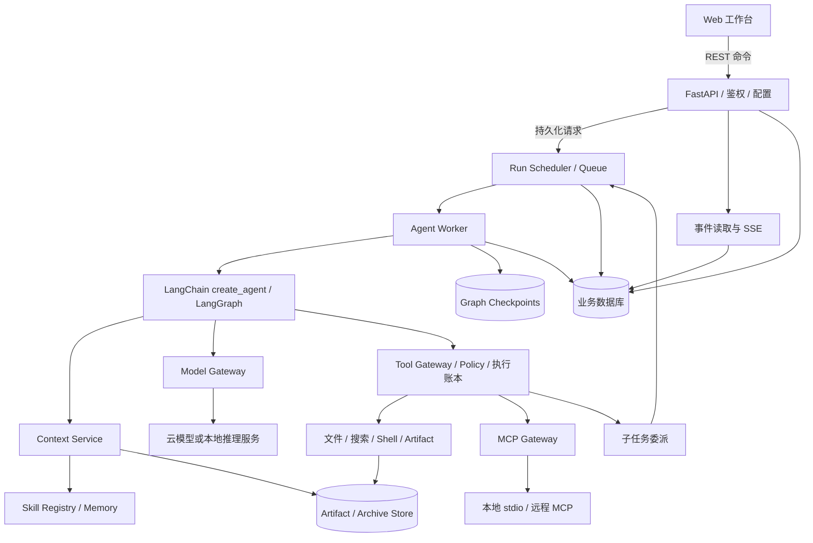
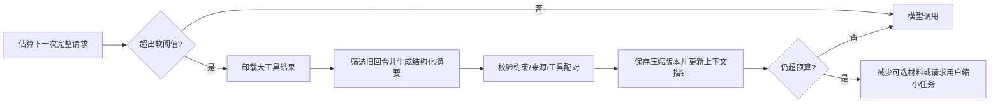
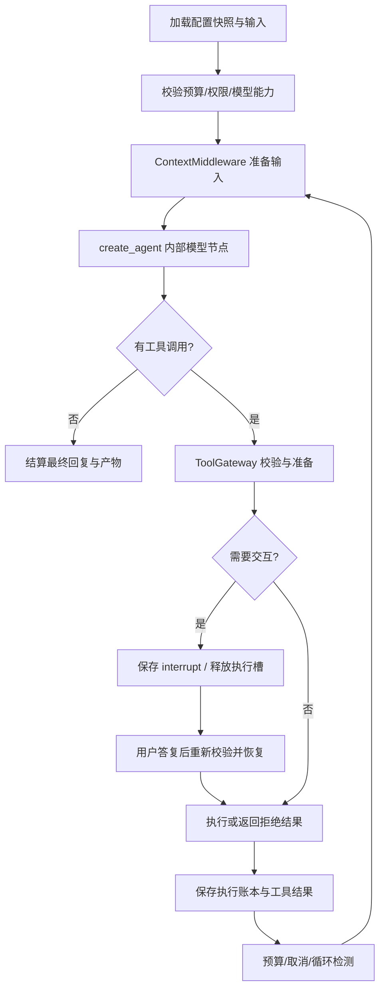
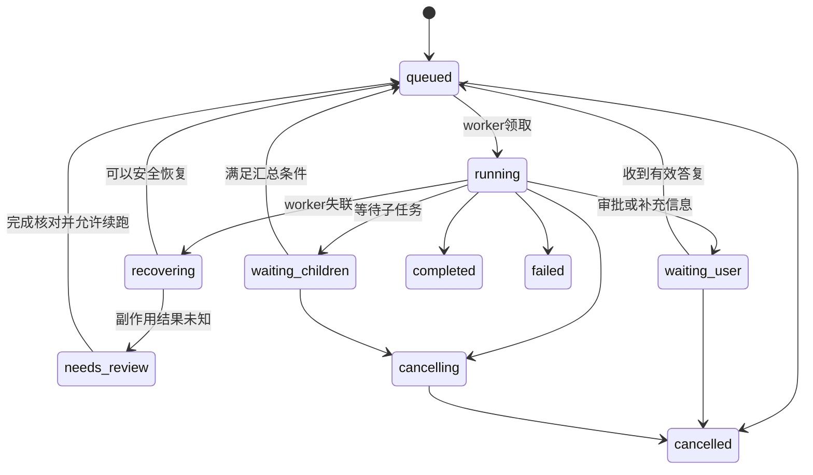
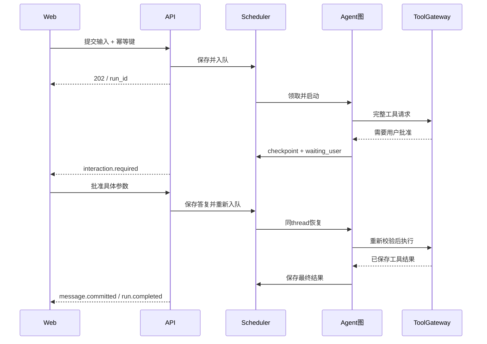

# 基于 LangChain 与 LangGraph 的通用 Agent Harness 系统设计

**文档版本：1.0｜调研日期：2026-09-17（北京时间）｜状态：架构设计与实施建议，尚未开发及实测**

> 本文现作为总体设计与调研快照保留。开发请使用 [实现指导总入口](implementation/README.md)：各模块实现规则已划分唯一维护位置，本文不再作为另一份同步更新的实现规范。

目标形态：运行在用户计算机上的常驻服务，以及通过浏览器访问的 Web 工作台。以 DeepSeek Harness 的可扩展工作环境为产品参照，以 LangChain、LangGraph 为主要运行基础。

本文将“官方资料确认的事实”“本项目的设计建议”“需要原型验证的假设”分开表述。表格中的优先级、默认参数、容量目标和工期均为设计建议，不代表框架默认值或已完成的性能测试。在线文档会变化，实际开发必须锁定依赖版本并进行兼容测试。

## 目录

1. [设计结论与范围](#s1)
2. [技术调研与参照系统分析](#s2)
3. [功能设计与使用流程](#s3)
4. [系统架构与技术选型](#s4)
5. [统一模型接入](#s5)
6. [上下文与记忆管理](#s6)
7. [Agent 运行内核](#s7)
8. [任务与多 Agent 调度](#s8)
9. [基础工具与执行环境](#s9)
10. [Skills 管理](#s10)
11. [MCP 集成](#s11)
12. [插件机制与扩展契约](#s12)
13. [数据模型与一致性](#s13)
14. [API、事件流与 Web 工作台](#s14)
15. [权限、安全与本地部署](#s15)
16. [可观测性、测试与验收](#s16)
17. [实施路线与工作量](#s17)
18. [架构决策与待验证问题](#s18)
19. [资料来源与调研附件](#s19)

<a id="s1"></a>
## 1. 设计结论与范围

### 1.1 推荐方案

建议建设一个**模块化单体、本地优先、具有可恢复执行能力的 Agent 工作平台**：

- **Web 层**：React + TypeScript，负责会话、执行轨迹、审批、文件产物、Agent、模型、Skills 与 MCP 配置。
- **服务层**：Python + FastAPI，提供统一 API、鉴权、事件订阅和配置管理。
- **执行层**：使用 LangChain `create_agent` 构建唯一的模型—工具循环，复用底层 LangGraph 的状态、checkpoint、interrupt 和 streaming。
- **调度层**：应用自己维护持久化任务队列、运行状态、资源配额、取消与父子任务关系；LangGraph 不替代这层进程与任务管理。
- **能力层**：Model Gateway、Context Service、Tool Gateway、Skill Registry、MCP Gateway、Artifact Store，通过稳定接口接入内核。
- **存储层**：本地初期使用 SQLite 与文件对象存储；需要多人协作和多 worker 时切换 PostgreSQL。向量检索按需引入。
- **部署层**：一个启动命令启动本地服务与 worker，由服务提供 Web 静态资源；默认仅监听 `127.0.0.1`。

核心原则是：**复用 Agent 循环，自建产品所需的运行治理；每类职责只有一个最终执行者。**

模型循环由 `create_agent` 持有；工具权限和副作用由 Tool Gateway 持有；上下文压缩由 Context Service 持有；运行状态由 Scheduler 持有。不得再并行开启另一套 Deep Agents 压缩、独立工具执行或隐式后台调度，造成重复行为。

### 1.2 “通用”的工程含义

通用性指能够用统一运行契约承载研究、编码、文件处理、知识查询、业务工具调用等任务，并允许替换模型、工具与技能。它不意味着任意模型都能可靠执行任意任务。

例如，不支持原生工具调用的模型可以进入文本问答模式；没有视觉能力的模型不能直接理解截图；本地模型可以避免内容发送至云端，但其能力和速度仍需要单独评测。

### 1.3 首期假设与边界

| 项目 | 本文采用的默认假设 |
|---|---|
| 用户规模 | 首期单用户、本地部署；数据结构预留 owner 与 workspace 隔离 |
| 操作系统 | Windows 优先，同时保留 macOS/Linux 实现路径 |
| 模型来源 | 云端 API、自定义兼容端点、本地推理服务均可配置 |
| 主要输入 | 文本、文件、项目目录；图片能力由模型 profile 决定 |
| 执行方式 | 前台对话与后台任务共用一套运行模型 |
| 网络 | 本地服务可离线运行；云模型、搜索和远程 MCP 依赖网络 |
| 首期不做 | 公有云多租户、插件商业市场、移动原生客户端、自研推理引擎 |
| 外部系统修改 | 必须符合用户授权与工作区策略；关键操作展示具体参数和影响 |

这里的“本地优先”是服务、状态与产物可以保留在本地，**不等于调用云模型时数据不会离开计算机**。模型出站与本地持久化是两个独立配置。

<a id="s2"></a>
## 2. 技术调研与参照系统分析

### 2.1 DeepSeek Harness 的参照价值

官方将 DeepSeek Harness 定位为基于 Cordis 的插件化 Agent Harness，提供 `dsh web` 本地服务与 Web UI。它不是 LangGraph 应用。官方仓库仍标注 developer preview，并明确可能有兼容性破坏。[官方仓库](https://github.com/deepseek-ai/deepseek-harness)

本次核实的源码快照为 `0d1f50007f9bca3f52b06e1c3074fa14d5fb0720`，提交日期为 2026-09-15，根包版本为 `0.1.6-alpha.1`。这表示本次研究的源码基线，不代表 npm 最新稳定版本，也不代表已经启动验证该版本。[固定版本 package.json](https://github.com/deepseek-ai/deepseek-harness/blob/0d1f50007f9bca3f52b06e1c3074fa14d5fb0720/package.json)

| 参照方向 | 对本系统的启发 | 应作出的调整 |
|---|---|---|
| 插件化组合 | 能力通过注册、生命周期和明确接口组合 | 核心安全、存储与调度不能被任意插件绕过 |
| 本地服务 + Web | 浏览器作为交互界面，服务作为执行主体 | 浏览器关闭不取消任务；事件支持重新订阅 |
| 可追溯会话 | 用户可查看工具执行、消息与上下文变化 | 区分原始档案、图 checkpoint 和 UI 事件 |
| 上下文扩展 | 大输出、技能资料按需载入 | 明确预算、来源、压缩版本和检索权限 |
| 子 Agent 与 Team | 可拆分任务并显示分工 | 自建有界调度与资源冲突控制，避免无限派生 |
| 多种插件能力 | 模型、工具、界面可以扩展 | SDK 版本化，运行时锁定扩展清单 |

不建议复刻 Cordis 生命周期来包裹 LangGraph。应保留相似的用户体验和能力边界，用 Python 接口与 LangGraph 原语实现运行机制。现有 DSH 插件的二进制、包依赖及上下文 API 不会天然兼容本系统。

**值得具体借鉴的机制：**

- DSH 使用追加式 Session log 重建模型历史；压缩保存摘要与替代范围，原始历史仍可回查。流式 token 在结算前属于临时数据，存储接口区分 append 接收和 flush 耐久性屏障。本项目借鉴这些可追溯与提交边界，但不再自建一套图执行引擎。[架构](https://github.com/deepseek-ai/deepseek-harness/blob/0d1f50007f9bca3f52b06e1c3074fa14d5fb0720/docs/architecture.md)、[持久化](https://github.com/deepseek-ai/deepseek-harness/blob/0d1f50007f9bca3f52b06e1c3074fa14d5fb0720/docs/subsystems/persistence.md)
- 官方已有 experimental Agent Teams，属于额外启用的能力；协调在单进程与共享工作区内进行，`writeScopes` 仅提示冲突。本项目要另外实现写入锁、预算与工作目录隔离。[Teams 实现说明](https://github.com/deepseek-ai/deepseek-harness/blob/0d1f50007f9bca3f52b06e1c3074fa14d5fb0720/packages/experimental/agent-team/README.md)
- 当前 DSH MCP 支持 tools、resources、instructions 及 stdio/Streamable HTTP，但未支持 prompts、elicitation、task execution 和 resource subscriptions。本项目也必须逐项声明支持边界。[MCP 子系统](https://github.com/deepseek-ai/deepseek-harness/blob/0d1f50007f9bca3f52b06e1c3074fa14d5fb0720/docs/subsystems/mcp.md)
- DSH Web 使用 HTTP unary RPC 与复用 WebSocket 流，并有浏览器认证及 Host/Origin 校验。本文的 REST + SSE 是针对首期需求作出的独立选择，后续终端交互再增加 WebSocket。[连接层](https://github.com/deepseek-ai/deepseek-harness/blob/0d1f50007f9bca3f52b06e1c3074fa14d5fb0720/packages/client/connection/README.md)

### 2.2 LangChain、LangGraph、Deep Agents 的分工

| 技术 | 官方能力定位 | 本系统使用方式 | 不能直接推导出的能力 |
|---|---|---|---|
| LangChain | 模型、消息、工具及 Agent/middleware 抽象 | 模型接入、`create_agent`、工具与策略挂接 | 不自动消除模型协议差异 |
| LangGraph | 有状态图运行、持久化、中断、流式输出 | checkpoint、恢复、子图及必要的业务流程编排 | 不自动实现主机级队列、资源锁、沙箱 |
| Deep Agents | 已组合规划、文件系统、子 Agent、上下文等能力的 Harness | 作为快速原型与可选 RuntimeAdapter 的候选 | 默认后端与工具策略不一定符合本系统的隔离和审计约束 |
| Agent Server | 提供部署、运行管理等服务器能力的产品运行时 | 作为后续部署替代方案评估 | 不等同于仅安装开源 LangGraph 库 |
| LangSmith | 追踪与评估等平台能力 | 用户选择启用的观测出口 | 本地核心运行不依赖上传轨迹 |

依据：[LangChain Agent](https://docs.langchain.com/oss/python/langchain/agents)、[LangGraph 概览](https://docs.langchain.com/oss/python/langgraph/overview)、[Deep Agents 概览](https://docs.langchain.com/oss/python/deepagents/overview)。

### 2.3 三条实现路线

| 路线 | 优势 | 代价 | 建议 |
|---|---|---|---|
| A：Deep Agents + 产品外壳 | 规划、文件、子 Agent、压缩等较快可用 | 必须调整 backend、权限、事件和调度契约；默认行为可能较重 | 适合快速验证任务效果；作为 PoC 对照 |
| B：`create_agent` + 自有服务与 middleware | 保留成熟 Agent 循环，易控制治理边界 | 仍需实现上下文编排、工具网关、队列与产品层 | **本项目默认路线** |
| C：原生 `StateGraph` 全自定义 | 节点、分支、恢复点完全可控 | 自行承担循环、工具调用协议和 middleware 等维护成本 | 仅在 B 无法表达必要语义时采用 |

路线 B 也可以把返回的 Agent 图放入外层 `StateGraph`，但外层仅负责预处理、验证与收尾，不再实现第二个模型—工具循环。LangChain 的 AgentMiddleware 面向 `create_agent`；不能将它当成任意 `StateGraph` 都能直接加载的插件。[Middleware 概览](https://docs.langchain.com/oss/python/langchain/middleware/overview)

### 2.4 本次调研中必须关注的版本变化

1. MCP 官方当前协议为 **2026-07-28**，核心请求与能力协商语义已经变化；不能把旧版 `initialize` 与 session 机制写成所有版本的通用前提。[MCP 版本规则](https://modelcontextprotocol.io/docs/2026-07-28/learn/versioning)
2. LangChain MCP 支持已迁入 **`langchain.mcp.MCPAdapter`**，迁移文档注明需要 `langchain[mcp]>=1.4.0` 且 API 处于 beta。旧的 `langchain-mcp-adapters` 不作为新项目长期核心依赖。[迁移说明](https://docs.langchain.com/oss/python/migrate/langchain-mcp-adapters)
3. 模型能力信息、协议适配器和插件接口都会变化。**声明支持、依赖安装成功、服务启动成功、端到端调用成功**是四个不同验收层级。

<a id="s3"></a>
## 3. 功能设计与使用流程

### 3.1 功能清单

优先级定义：P0 为首个完整可用版本；P1 为首轮增强；P2 为规模化及生态扩展。

| 模块 | 用户可见功能 | 后端关键能力 | 优先级 |
|---|---|---|---|
| 工作区 | 添加项目目录、设置授权路径与网络策略 | 路径解析、命名空间、配置快照 | P0 |
| 模型中心 | 添加供应商、测试连接、查看能力、选择模型 | Provider adapter、能力测试、密钥引用 | P0 |
| 会话 | 多会话、流式回复、重命名、归档、导出 | 消息档案、run、checkpoint、事件流 | P0 |
| 运行控制 | 停止、审批后继续、服务重启后恢复 | 持久队列、取消树、interrupt/resume | P0 |
| 上下文 | 使用量、压缩记录、文件引用、手动固定关键内容 | 预算分配、归档、摘要与重建 | P0 |
| 基础工具 | 文件读写、搜索、补丁、受控命令、网页获取 | Tool Gateway、执行隔离与输出卸载 | P0 |
| Skills | 扫描、查看、启用、停用、显式调用 | 标准元数据、渐进加载、版本快照 | P0 |
| MCP | 添加本地/远程服务、连接诊断、工具清单 | 协议适配、凭据、重连、结果转换 | P0 |
| 审批 | 具体操作预览、允许一次、拒绝、有限范围授权 | 参数摘要绑定、有效期、审计 | P0 |
| Agent 模板 | 系统指令、模型、工具、技能和预算配置 | AgentSpec 版本与有效配置校验 | P0 |
| 子 Agent | 显式委派、独立上下文、结果汇总 | 父子任务、有界并发、预算继承 | P1；P0 预留数据结构 |
| 长期记忆 | 查看、批准写入、纠正、删除 | 命名空间、来源、有效期、检索索引 | P1 |
| 会话分支 | 从历史点继续、比较不同尝试 | branch/checkpoint 分离，副作用预览 | P1 |
| MCP 增强 | Resources、Prompts、elicitation、OAuth 完整体验 | 专用 client 与交互桥接 | P1；P0 明确不支持项 |
| 调度增强 | 定时任务、任务模板、Agent Team 看板 | 独立调度入口、任务依赖与冲突管理 | P2 |
| 生态 | 第三方插件安装、签名、兼容性诊断 | 外部进程隔离、SDK、版本约束 | P2 |

MVP 也必须包含基本恢复、权限与输出限额，不能只做“聊天窗口 + 一组工具”后把这些能力全部延期。

### 3.2 主要用户旅程

**首次使用**：启动服务 → 在本机完成配对 → 添加工作区 → 配置模型密钥 → 执行小型连接/工具调用测试 → 选择默认 Agent → 创建会话。连接测试产生的费用与发送内容应可见。

**文件处理**：用户提交任务 → Agent 检索工作区文件 → 展示计划或执行进度 → 需要写入时按策略生成补丁 → 获得适用授权后执行 → 展示文件差异及最终产物。审批无需每一步重复，但不能将“允许读取”扩展为“允许任意执行”。

**研究任务**：加载研究 Skill → 搜索与读取网页 → 将大结果存为资料产物 → 必要时委派独立子任务 → 汇总带来源的文档 → 保存文件并提供预览。搜索供应商是可替换工具，不与某个模型供应商绑定。

**服务崩溃后恢复**：启动时扫描非终态任务 → 校验 worker 所有权与 checkpoint → 对可安全重试的节点自动恢复 → 对结果未知的外部写操作进入待核对状态 → Web 显示准确恢复原因。

### 3.3 AgentSpec

每个 Agent 是可版本化配置，而不是独立安装的一套应用：

```yaml
id: research-assistant
revision: 3
runtime: langchain-agent-v1
system_prompt_ref: prompts/research-v3.md
model_policy: research-default
tools: [file_read, text_search, web_search, web_fetch, artifact_write]
skills: [research]
mcp_servers: [reference-library]
policy: workspace-standard
context_policy: balanced-v1
budget:
  max_model_calls: 40
  max_total_tokens: 200000
  max_wall_seconds: 900
  max_children: 3
```

上述字段属于本项目设计。真实模型名、密钥、目录与第三方服务地址由部署配置提供；示例不代表可直接运行的配置文件。

<a id="s4"></a>
## 4. 系统架构与技术选型

### 4.1 逻辑架构



这是逻辑模块图，并不要求每个方框部署成微服务。

### 4.2 首期进程模型

建议由一个本地 supervisor 管理两个长期进程：

1. **API 进程**：提供 Web 静态页面、REST 与 SSE，不执行长时间 Agent 任务。
2. **worker 进程**：运行一个异步 worker，内部设置有限并发；持有模型连接、图运行和受控工具执行。

Shell 与 stdio MCP 根据需要生成受管理子进程。API 重启不应终止 worker；worker 重启不能让 API 误报任务成功。前期不引入 Redis、Celery 或 Kubernetes，仅保留替换 Scheduler 的接口。

### 4.3 技术选择与理由

| 层 | 推荐技术 | 原因与限制 |
|---|---|---|
| 后端语言 | Python，PoC 以 3.12 为候选 | LangChain 与 AI 工具生态直接；依赖锁定后确认各平台兼容 |
| API | FastAPI + Pydantic | 异步接口、校验、OpenAPI；长任务交给 worker |
| Agent | LangChain `create_agent` | 复用循环和 middleware，减少协议性重复工作 |
| 图运行 | LangGraph | checkpoint、interrupt、streaming 与子图 |
| MCP | `langchain.mcp` + FastMCP，经自有接口包装 | 新 API 是 beta，必须锁版本与测试；不向业务暴露变化 |
| 数据库 | SQLite WAL → PostgreSQL | 先满足单机；多人/多 worker 再升级；WAL 仍只有一个写者 |
| checkpoint | 对应的 SQLite/PostgreSQL saver | 框架数据与业务表分开管理，测试同步持久化选项 |
| 前端 | React + TypeScript + Vite | 组件与流式界面开发直接，无需首期增加 SSR 服务 |
| 前端数据 | REST 查询缓存 + reducer 处理 run events | 区分服务端事实与临时 UI 状态，按 event ID 去重 |
| 实时通道 | SSE；终端交互需要时增加 WebSocket | 对话与事件单向推送足够；双向终端单独处理 |
| 搜索 | 文件 `rg` + 数据库元数据；可选全文索引 | 先提供可靠关键词检索，中文索引质量单独评估 |
| 语义检索 | 可选嵌入索引 | 不作为运行基础依赖；仅在评估证明有效后引入 |
| 观测 | 本地结构化日志与 OpenTelemetry 导出接口 | 云端 tracing 显式启用，并先脱敏 |

**Python 与 TypeScript 的取舍**：两者都有 LangChain/LangGraph 生态，但本项目以本地工具、数据处理和模型适配为重点，Python 后端更合适。前后端共享类型通过 OpenAPI 生成，不需要为“全栈同语言”增加运行层约束。新 MCP API 的语言可用性按实际发布核验，不能假设两端同步。[LangChain MCP 官方发布说明](https://www.langchain.com/blog/mcp-in-langchain-stateless-protocol-elicitation-and-more)

### 4.4 自建服务与 Agent Server 的边界

自建方案适合本机单用户、数据控制和轻量安装，但要承担队列、鉴权、运行管理与恢复的工程工作。若后续需要大规模部署，可评估 Agent Server 来替换应用运行管理部分；必须同时评估许可、部署依赖、网络出站和运维要求。不要同时维持两套互相抢占任务所有权的调度系统。[Agent Server](https://docs.langchain.com/langsmith/agent-server)

<a id="s5"></a>
## 5. 统一模型接入

### 5.1 兼容性的四个层次

| 层次 | 要验证的内容 | 典型失败 |
|---|---|---|
| 传输 | URL、鉴权、代理、超时、TLS、流式连接 | 能列模型但无法完成一次生成 |
| 消息 | role、内容块、工具结果关联、供应商专有字段 | 丢失工具 ID 或推理续接字段导致下一轮报错 |
| 能力 | 工具调用、JSON schema、视觉、usage、缓存 | 端点接受参数但模型不实际遵循 |
| 行为 | 多轮工具选择、任务完成、成本与延迟 | 单次调用成功，连续执行不稳定 |

LangChain 提供统一模型接口及 profile，但 profile 是辅助能力描述，不能替代针对实际 endpoint/model 的测试。[模型接口与 profiles](https://docs.langchain.com/oss/python/langchain/models)

### 5.2 Model Gateway

对运行内核提供以下逻辑接口：

```text
resolve_model(policy, required_capabilities) -> ModelHandle
estimate_input(messages, tools, attachments) -> TokenEstimate
stream(request) -> AsyncIterator[NormalizedModelEvent]
classify_error(error) -> RetryDecision
validate_response(response) -> ValidatedAssistantTurn
```

尽量使用供应商专用 LangChain 集成包。自定义兼容端点走兼容 adapter，但标注具体协议与能力，不把所有接口都当作完整的同一协议。模型端点测试、密钥获取和请求发出均在服务端完成。

首批接入候选如下；这是适配路线，不是全型号支持承诺：

| 服务类型 | 优先适配路线 | 必须单独确认 |
|---|---|---|
| DeepSeek 官方 API | `langchain-deepseek / ChatDeepSeek` | 实际模型的工具、推理续接和上下文能力 |
| OpenAI 官方 API | `langchain-openai / ChatOpenAI` | 所选 API 模式、内容块及供应商内置工具 |
| Anthropic / Gemini | 各自供应商集成包 | schema、消息顺序、多模态与推理参数差异 |
| Ollama 本地推理 | `langchain-ollama / ChatOllama` | 模型本身是否经过工具调用训练、资源与窗口配置 |
| 自定义兼容网关 | 明确指定协议的兼容 adapter | 兼容程度、usage、流式 tool calls 与专有字段 |

包入口可参考 [ChatDeepSeek](https://docs.langchain.com/oss/python/integrations/chat/deepseek)、[ChatOpenAI](https://docs.langchain.com/oss/python/integrations/chat/openai)、[ChatOllama](https://docs.langchain.com/oss/python/integrations/chat/ollama)。集成文档中的历史型号示例不作为当前型号能力表；最终以供应商当前文档和契约测试共同确认。

建议的注册数据：

```yaml
provider_id: local-inference
adapter: ollama
endpoint_ref: local-ollama
credential_ref: null
model_id: configured-model
capabilities:
  text: verified
  tool_calling: verified
  structured_output: unverified
  vision: unsupported
  streaming_usage: unverified
context:
  max_input_tokens: null
  max_output_tokens: null
  tokenizer: estimated
verification:
  suite_version: model-contract-v1
  tested_at: null
```

`verified/unverified/unsupported` 避免把“未知”误当成“不支持”或“支持”。实际配置必须在启用自主工具执行前通过对应能力测试。

### 5.3 统一消息结构

消息需要包含：`message_id`、role、文本/图片/音频等 content blocks、tool calls、tool results、usage、供应商名称及必要的 provider metadata。业务 API 输出标准结构；适配层保留下一轮协议需要的原始字段。

不能把所有结果压成字符串。对于推理信息、签名块、缓存标识等字段，区分：用于协议续接的数据、可以展示给用户的说明、仅允许内部保存的元数据。不要承诺显示模型未公开的内部推理。

流式事件至少区分 `text.delta`、`tool_call.delta`、`usage.update`、`response.completed`、`response.failed`。**工具参数只有在完整响应结束、JSON 完整解析且 schema 校验通过后才能执行**；不在半个 JSON 到达时启动工具。Ollama 官方示例同样强调流式结果需要聚合并随工具结果回传必要字段。[Ollama 工具调用](https://docs.ollama.com/capabilities/tool-calling)

### 5.4 能力协商与降级

| 情况 | 处理策略 |
|---|---|
| 没有原生工具调用 | 降级为纯文本；实验性文本解析单独开关，默认无副作用权限 |
| 不支持并行工具调用 | 串行调用，不模拟供应商不存在的语义 |
| 不支持结构化输出 | 普通文本 + schema 校验 + 有界修复；失败明确返回 |
| 不支持图片 | 提示切换有视觉能力的模型，或通过获准的 OCR 工具生成文字 |
| 没有准确 tokenizer | 保守估计并预留额外余量，用实际 usage 持续校准 |
| 缺少 usage | 展示“估计值”；金额未知时不显示为零 |
| 模型上下文更小 | 重新组装上下文，禁止直接透传原模型全部历史 |

### 5.5 路由、重试与预算

Agent 主模型、摘要模型和检索/嵌入模型可以分别配置。自动路由首先满足数据出站策略、能力与上下文，再比较成本、延迟和任务表现。

- 认证错误、模型不存在、参数错误直接报告；暂时网络错误和限流按指数退避与 jitter 有界重试。
- 明确由 Gateway 持有总重试预算，减少 SDK、middleware、worker 叠加重试造成的倍增。
- 流中断后以 `attempt_id` 标识新尝试；不能把不同尝试的文本拼成同一完整回答。
- 模型切换只发生在安全回合边界。已有未配对工具调用或供应商专有续接状态时，先收束回合或重建新的标准上下文。
- 不支持跨供应商直接续传的 opaque 状态不能强行转换。
- 子任务、摘要与失败重试都计入根任务 token/费用预算；不同模型 token 仅用于资源合计，不视为同等成本。

### 5.6 接入验收

每个 adapter/model/endpoint 组合至少执行：文本生成、流式聚合、单工具、多轮工具、无效参数、工具错误、schema 输出、取消、限流与断流、usage、长输入边界。带图片或推理续接的模型增加对应场景。连接测试通过只代表传输可达。

<a id="s6"></a>
## 6. 上下文与记忆管理

### 6.1 四类数据分开管理

| 类型 | 内容 | 生命周期 | 是否直接进入模型 |
|---|---|---|---|
| 活跃上下文 | 当前目标、最近消息、必要工具结果、选中的技能 | 每次模型调用重建或裁剪 | 是，受预算约束 |
| 会话档案 | 原始消息、完整工具输出、压缩记录、输入引用 | 随会话保存并可导出 | 按需读取 |
| 长期记忆 | 经确认的偏好、项目约定、稳定事实 | 跨会话，含来源与有效期 | 检索后选择性注入 |
| 运行 checkpoint | 图状态、下一步、中断与局部执行结果 | 支持续跑与分支 | 仅其中必要内容 |

Graph checkpoint 不是完整用户档案，也不是知识库。长期记忆不等于把所有对话放进向量数据库。LangGraph 将 thread persistence 与跨会话 store 作为不同概念；应用仍需设计内容与权限策略。[LangGraph 持久化](https://docs.langchain.com/oss/python/langgraph/persistence)

### 6.2 Context Composer

每次调用模型按以下顺序构建输入：

1. 受信任的系统规则与当前权限边界。
2. Agent 指令、已批准的项目约定。
3. 当前用户任务、后续修正与明确约束。
4. 必要的运行状态：待办、已验证事实、未完成操作。
5. 已选择的 Skills 元数据或正文。
6. 来源可追溯的长期记忆与检索材料。
7. 近期完整回合、摘要和需要保留的工具交互。

顺序同时用于内容选择，但**不能仅靠提示词顺序实现安全权限**。来自文件、网页、MCP 与 Skill 的文本都不能扩大操作系统权限或自动改变用户授权。

每次模型调用生成 `input_view_id`，记录最终消息引用、工具 schema hash、Skill/摘要版本、模型 profile、token 估算和规范化请求 hash。必要时保存不含鉴权头的输入快照，使“模型当时实际看到了什么”可以回查；仅保存 UI 对话不足以复现压缩、动态工具选择和隐藏资料注入。

### 6.3 Token 预算

先统一供应商限制的语义。如果供应商给出联合上下文上限 `W`、独立输入上限 `I`、计划输出 `O` 与安全余量 `S`：

```text
可用输入预算 B = min(I, W - O) - S
```

没有独立上限时忽略对应项；如果供应商的输入上限已经排除了输出，则不得重复减去输出。某些推理 token 会占用输出或总预算，必须由 adapter 正规化。

例如，假设联合窗口为 65,536 tokens，输出预留 8,192，余量 4,096，且没有更低输入限制，则 `B=53,248`。系统指令、工具 JSON schema、Skills、图片估算和协议包装都计入 B。

建议初始策略：达到 B 的 75% 时尝试卸载与压缩，压缩至 50%～60%；接近硬上限时先缩减可选资料，再缩小工具目录或停止请求。阈值是可调初值，需用任务集验证。

### 6.4 压缩流水线



实现约束：

- 先完整保存原始内容，再用“摘要 + 产物引用 + 可读取范围”替换大输出。
- 压缩只在完整消息边界执行；工具调用与其结果不能被分割成非法历史。
- 对供应商要求的消息字段保留协议完整性；不能仅从 UI 文本重建模型历史。
- 摘要保留目标、硬约束、已做修改、证据、失败方法、未决问题和下一步。
- 未完成工具调用、等待中的审批参数和用户最新修正不能被摘要覆盖。
- 摘要对象记录输入消息区间、来源摘要、模型版本、时间和 hash；存储成功后才切换 active pointer。
- 压缩失败保持旧版本，不删除原始历史；超过硬上限时暂停模型调用。
- 更新采用版本比较，避免压缩期间到达的新用户消息被覆盖。

首期由 ContextMiddleware 统一驱动，可封装 LangChain 的摘要能力；若采用现成 SummarizationMiddleware，则关闭另一套重复摘要逻辑。新增“工具输出卸载”可以与摘要共存，但由同一个 Context Service 调度。[LangChain 短期记忆](https://docs.langchain.com/oss/python/langchain/short-term-memory)

### 6.5 长期记忆

建议的 MemoryRecord：`id/owner/workspace/scope/kind/content/source_refs/created_at/expires_at/confidence/status`。

写入流程为“提议 → 策略校验 → 用户确认或已配置的有限自动规则 → 保存 → 建索引”。默认不把模型猜测、网页指令、临时错误或工具日志提升为稳定事实。用户可以查看、纠正和删除记忆。

检索先按 owner/workspace/权限过滤，再做关键词或向量搜索；禁止先全库检索后仅靠模型忽略越权内容。新任务优先当前明确指令；历史记忆冲突时显示来源与日期。

记忆删除同时处理索引与缓存；备份中的保留期限单独说明。全量会话归档和可撤销的长期记忆使用不同删除策略。

### 6.6 对用户的可解释性

上下文面板显示：总预算、估计/实际用量、指令/工具/历史/材料占比、已加载 Skills、最近压缩点、被卸载产物及引用来源。用户可以固定关键事实，但固定项仍受模型硬上限约束。

<a id="s7"></a>
## 7. Agent 运行内核

### 7.1 最小运行契约

RuntimeAdapter 暴露：`start`、`resume`、`request_cancel`、`get_checkpoint`、`inspect_interrupts`、`stream_events`。上层不直接依赖具体图节点名或框架内部事件结构。

默认实现是 `LangChainAgentRuntime`。日后加入 `DeepAgentRuntime` 时，必须满足同一权限、预算、事件、产物与恢复契约，不能仅通过“返回文本”判断兼容。

### 7.2 逻辑运行流程



图中描述的是实际职责，不要求按图名另写一份 Agent 循环。模型与工具循环依然由 `create_agent` 负责。

### 7.3 Middleware 挂接

| 挂接点 | 本项目职责 |
|---|---|
| Agent 开始前 | 读取不可变配置快照、建立 trace、确认输入版本 |
| Model 调用前 | 上下文预算、技能选择、工具选择、取消检查 |
| Model 包装层 | 供应商路由、统一错误、token 与费用预留 |
| Model 调用后 | 聚合完整输出、usage 结算、循环检测 |
| Tool 包装层 | 权限、审批、并发配额、ledger、输出卸载 |
| Agent 结束后 | 产物校验、候选最终结果、产物引用与待提议记忆；不直接结算 run |

链条顺序通过集成测试固定。框架可能并行运行独立工具；所有工具仍必须进入 Gateway，由 Gateway 串行化冲突写操作。不得通过自定义 BaseTool 旁路审批或账本。

Worker 在图调用正常结束、最后 checkpoint 已持久化、必要产物与子任务已处理后，使用 CAS 结算 run 并写出最终事件。`after_agent` 仍在图执行内部，不能提前把数据库中的 run 标为 completed。

### 7.4 状态与运行时对象分离

checkpoint 可以保存：消息、摘要引用、步骤计数、当前计划、子任务引用、interrupt 信息、配置版本和 source manifest。

不应保存：数据库连接、MCP 活连接、密钥明文、HTTP client、锁对象、子进程句柄。它们在 worker 启动或恢复时根据引用重新建立。

P0 默认采用持久 saver 并以 `durability="sync"` 执行，确保包含完整模型响应的 checkpoint 在下一工具步骤前保存。否则模型回合丢失后重生成的新 tool call ID 可能绕过旧执行账本。未来改用异步 checkpoint 时，必须先引入等效的持久模型输出 journal 和工具前置屏障，再评估性能收益。[Checkpointer 与 durability 模式](https://docs.langchain.com/oss/python/langgraph/checkpointers)

`run_id`、身份、工作区、凭据访问器等通过框架运行 context 传入；具体敏感配置不进入模型输入或日志。

### 7.5 人工交互与恢复

审批、补充信息和 MCP elicitation 在 UI 中属于不同交互类型；后台统一记录等待对象，但保留各自 schema 与来源。

LangGraph interrupt 恢复可能从节点开头重新执行，因此 interrupt 前后的代码必须满足重放约束。不能在暂停前先执行不可逆操作，也不能认为暂停函数之后就是 Python 原指令位置继续运行。[LangGraph Interrupts](https://docs.langchain.com/oss/python/langgraph/interrupts)

操作顺序：准备规范化参数 → 记录待批请求 → interrupt → 恢复时重新验证授权与资源版本 → 执行副作用。待批请求以 `(run_id, operation_id, params_hash)` 唯一，恢复不能创建一串重复审批。

用户改动参数后重新计算 hash 并再次执行策略判断；不沿用原参数的批准。拒绝操作返回明确工具结果，模型可以调整计划。

### 7.6 退出条件

完成、用户取消、预算耗尽、wall deadline、连续重复失败、循环检测、权限拒绝后无可行路径、模型协议失败，均有明确状态。预算耗尽可以形成待用户加预算的暂停，但不得后台自行提高上限。

初始循环检测规则：相同工具及规范化参数连续失败三次，或连续多轮无新产物/状态变化时暂停；对合法轮询工具另设等待策略，避免误判。

<a id="s8"></a>
## 8. 任务与多 Agent 调度

### 8.1 四个概念

| 概念 | 定义 |
|---|---|
| Agent | 一份能力与行为配置 |
| Session/Thread | 用户持续交互的容器 |
| Run | 一次从输入开始、到完成/失败/取消结束的执行实例 |
| Job/Attempt | 调度器领取的执行工作单元及重试尝试 |

同一个 Agent 可以服务多个 session。一个 session 包含多个 run。一个 run 可能经过多次 worker attempt，也可能派生多个 child run。LangGraph `thread_id` 不应随每次重试变化。

### 8.2 Run 状态机



终态不能仅根据“模型发出了最终文本”设置。需要确认必要产物已经落盘，最终结果已经登记，待处理子任务和命令已经结束或被明确转交。

### 8.3 本地队列与互斥

P0 采用 SQLite 持久 run queue、单个 worker 进程与有限异步并发。领取任务使用短事务与条件更新，设置 `lease_owner/lease_expires_at/attempt/fencing_token`。同一 branch 同时只允许一个逻辑活跃 run，通过 `branch.active_run_id` 控制；其他输入排队。

`waiting_user/waiting_children/needs_review` 释放 worker 物理执行槽，但仍保留 branch 的逻辑所有权，避免另一 run 推进同一 graph thread 后再恢复过期审批。child run 分配独立内部 branch/thread key，不继承父 branch 的写入锁。逻辑所有权只在 run 进入终态或经过明确转交协议后释放。

建议初值：全局最多 4 个活跃模型调用、每根任务最多 2 个并行子任务、子任务深度 2、每个有状态 MCP client 默认串行、同一工作区写操作默认串行。硬件较弱的本地推理服务可将模型并发降为 1。

数据库 lease 防止两个 worker 同时提交状态，但不能阻止失联旧进程继续写文件或远端服务。因此任务重分配前必须确认旧进程退出、撤销可撤销的执行权限并处理未知副作用；仅有租约超时不满足安全接管条件。

### 8.4 子 Agent 调度

建议首个多 Agent 版本只支持**父 Agent 显式委派独立子任务**。不默认启用互相自由发消息的自治 Team。

子任务输入包含：目标、完成标准、允许读取的资料引用、工具子集、数据出站约束、独立预算、deadline、写入范围、结果 schema。

子任务默认接收最小任务说明与筛选材料，不复制父会话全部历史。结果返回 `status/summary/evidence/artifacts/changes/blockers/usage`，父 Agent 负责核对和整合。

LangGraph 子图用于同一执行生命周期内的局部组合；需要独立取消、排队、恢复或长时间运行的子 Agent 使用**独立 child run**。二者不能混为“开启几个 coroutine”。[LangGraph 子图](https://docs.langchain.com/oss/python/langgraph/use-subgraphs)

委派协议必须耐久且幂等：使用稳定 `delegation_operation_id`，在一个业务事务内创建 child run、依赖关系、预算预留和 outbox；工具重放返回已有 child。父任务等待通过类型化内部 interrupt（`kind="children"`、`wait_id`）保存并退出图调用，不能仅在内存中 `await`，也不进入用户审批 UI。

子任务结算写出唤醒 outbox；父任务登记等待时同时检查孩子是否已完成，reconciliation 定期补偿，以处理“孩子先结束、父任务后登记等待”的竞态。唤醒映射到具体 interrupt ID 与 checkpoint，重复通知不会重复启动父任务。

### 8.5 防止调度死锁与资源失控

- 父任务等待子任务时保存状态并释放 worker 执行槽，不占着所有槽位等待孩子启动。
- 逻辑 run 配额与物理模型/工具槽分开；父任务可以保留逻辑身份但不持有模型连接配额。
- 根任务总预算采取原子预留：派生子任务先扣预留，结束后按实际消费结算，剩余释放。
- 预算覆盖所有后代、摘要和重试；子 Agent 不能通过继续派生逃逸预算。
- 取消按树传播，禁止取消后新建子任务；对不能立即停止的外部操作显示“停止请求已发送，结果待核对”。
- 若任务依赖其他任务，记录依赖边并拒绝环路。

### 8.6 并发写入与工作目录

读操作可以并行。首期写入统一由 Tool Gateway 按资源键串行化；文件修改同时使用预期 hash 校验。

编码任务可在 P1 使用独立 worktree 或临时工作区，子 Agent 返回 patch，由父任务合并。worktree 只隔离文件版本，不隔离网络、凭据和操作系统权限。非 Git 文件通过副本、版本 hash 与显式提交处理。

Agent 配置中声明的 `writeScopes` 只能描述意图，必须由执行器强制校验后才能形成有效隔离。

### 8.7 用户在运行中追加消息

P0 默认将后续输入创建为新 run，排队到当前 run 终态后执行；UI 显示“待处理”。审批答复属于当前 run 的 interaction，不创建新 run。紧急停止走独立 cancel API，不依赖模型读到“停止”二字。

P1 若提供运行中 steering，增加独立 input-command 实体与 API，记录 `consumed_by_run/consumed_revision`，只在安全边界单次消费并写入 checkpoint；同一输入不得同时形成排队 run。需要立刻改变方向时，先取消当前模型请求并核对未完成工具，再应用新输入；不任意篡改图状态。

<a id="s9"></a>
## 9. 基础工具与执行环境

### 9.1 工具目录

| 类别 | 首期工具 | 关键约束 |
|---|---|---|
| 文件 | list、read、write、apply_patch、stat | 授权根目录、大小上限、原子写、hash 校验 |
| 搜索 | filename/glob、text search | 优先 `rg`，限制目录与输出量 |
| 命令 | exec、poll、cancel | 独立进程组、超时、cwd/env 白名单、进程树终止 |
| 网络 | search、fetch | 网络范围、重定向复查、大小和类型限制 |
| 任务 | plan_update、delegate、inspect_child | 只操作授权任务及已登记子任务 |
| 产物 | create、read_range、list、preview | MIME 校验、引用稳定、浏览器隔离 |
| 交互 | request_input、request_approval | 持久等待对象、参数绑定、有效期 |
| 检索 | archive_search、memory_search | 权限先过滤，结果附出处 |

Python 执行可由受控命令实现；完整 Notebook、浏览器自动化、数据库写操作和邮件等外部动作作为后续工具插件接入。

### 9.2 ToolSpec 与 ToolResult

```text
ToolSpec:
  id, version, description, input_schema, output_schema
  origin: builtin | plugin | mcp
  effect: read | workspace_write | external_write | process
  retry_class: safe | idempotency_key_required | manual_reconcile
  required_capabilities, timeout, output_limit, concurrency_key

ToolResult:
  operation_id, status, summary, structured_data
  content_blocks, artifact_refs, truncated, exit_code
  started_at, completed_at, error_code, retryable
```

工具自报 `readOnly`、安全等级或幂等性只是输入信息。最终策略由 Host 配置与已审核实现决定，不能完全相信远程 MCP annotations。

### 9.3 工具调用流水线

```text
完整模型工具请求
→ 解析 schema 与规范化参数
→ 解析资源范围 / 检查配额
→ 创建 execution ledger
→ 策略判断与必要审批
→ 获取资源锁并复查参数与权限
→ 执行
→ 保存完整结果与摘要
→ 更新 ledger
→ 返回 ToolMessage 与 UI 事件
```

执行错误区分参数错误、权限拒绝、业务失败、传输故障、取消和结果未知。模型得到可采取下一步的摘要；诊断详情保留在受控日志与产物中。

### 9.4 副作用与幂等性

operation ID 从已持久化的模型回合、tool call ID 与 run 生成，不使用每次恢复都变化的随机值。参数 hash 用于防止同 ID 参数漂移；不能仅按参数 hash 把用户两次有意执行的相同操作合并。

| 操作类型 | 恢复规则 |
|---|---|
| 纯读取 | 在资源版本允许时安全重试 |
| 带外部幂等键的写入 | 使用相同 key 重试，查询外部状态后结算 |
| 文件覆盖 | 比较旧 hash、新 hash、临时文件与操作账本，判断是否已完成 |
| 任意 Shell/远端写入 | 若执行可能已发生但结果未落盘，标记 `unknown`，不得盲目重放 |

LangGraph checkpoint 不提供任意外部副作用的 exactly-once 保证。系统目标是**可恢复的执行、可识别的重复风险、明确的人工核对路径**。账本中“已开始”与“已完成”之间的崩溃窗口必须被测试。

### 9.5 大输出与进程管理

命令 stdout/stderr、网页正文与大型 JSON 首先写入受限产物存储，只向模型返回摘要、尾部、错误与读取指针。设置字节上限、磁盘配额、单行上限和进程输出速率限制。

Windows 使用 Job Object 或等效受控实现管理进程树；POSIX 使用进程组。普通 timeout 只取消 Python await，未必杀掉外部进程，所以必须验证子孙进程已经退出。

普通本机进程执行提供方便，但不是安全沙箱。沙箱模式可采用受控容器/虚拟机后端，并明确挂载、网络、资源和凭据边界；Windows 上通过 WSL2/Docker 的方案需要单独安装与平台验收。

<a id="s10"></a>
## 10. Skills 管理

### 10.1 Skill 的角色

Skill 是可复用的任务方法、约束和资料包；工具是执行动作；MCP 是外部能力连接协议。三者可以组合，但不是同一层抽象。

Agent Skills 标准以目录和 `SKILL.md` 为基础，正文与辅助资料按需加载。[Agent Skills 规范](https://agentskills.io/specification)

```text
skills/
  research/
    SKILL.md
    references/
    scripts/
    assets/
```

示例元数据：

```yaml
---
name: research
description: 调研技术问题，核实一手来源并输出设计材料。
metadata:
  harness-owner: local
---
```

本项目的权限、锁版本和依赖声明放入独立 Host manifest；不把自定义字段冒充通用 Agent Skills 标准。

### 10.2 发现、选择与渐进加载

1. 扫描用户配置的全局与工作区目录；不递归扫描整台计算机。
2. 解析并校验 frontmatter，形成 `name/description/source/hash` 目录。
3. 根据显式选择、任务匹配与 AgentSpec allowlist 给模型提供少量候选。
4. 激活后读取正文；继续需要时才加载 references、scripts 与 assets。
5. 记录激活原因、载入文件和内容 hash；同一 run 固定一个版本。

候选过多时做检索和阈值筛选，不一次性向系统提示词注入全部 Skill。用户通过 `/skill-name` 或界面指定时仍要校验权限和兼容性。

### 10.3 信任与覆盖规则

相同名称以 `(source_id, skill_name, revision)` 唯一标识，界面明确来源，不允许工作区中的同名文件静默覆盖用户已信任的全局 Skill。

Skill 的建议可以影响计划，但不能赋予文件、网络、命令或凭据权限。读取 Skill 和执行其脚本是两个事件；脚本必须经过 Tool Gateway，并遵守相同审批、输出限制和执行隔离。

用户更新 Skill 后，新 run 使用新 hash；旧 run 继续使用快照或提示显式迁移。未确认的远程更新不能替换正在执行的规则。

压缩和恢复需要保留仍适用的已激活 Skill 指令，或依据固定 hash 重新加载；若多项技能共同超出预算，应显式退激活或拆分任务，不能静默丢弃规则。相对资源路径从 Skill 根目录解析，校验逃逸、符号链接与归档解包边界。

### 10.4 管理界面

展示来源、说明、版本、内容差异、所需工具和实际授予权限；支持启用/停用、手动刷新、查看正文、显式调用与诊断。安装未知 Skill 不自动安装其 Python/npm 依赖，也不自动运行安装脚本。

### 10.5 Skills over MCP

独立可选扩展 `io.modelcontextprotocol/skills` 的 SEP-2640 已于 2026-09-13 合并；SDK 已发布版本的完整支持仍待验收，不是启用 MCP 核心后自动具备的能力。本文将其列为后续技能来源适配器。远程 Skill 仍进入同一 Registry、版本与信任流程，资源 URI 由对应 provider 解析，不冒充本地路径。[SEP-2640](https://github.com/modelcontextprotocol/modelcontextprotocol/pull/2640)、[扩展仓库](https://github.com/modelcontextprotocol/ext-skills)

<a id="s11"></a>
## 11. MCP 集成

### 11.1 架构定位

本系统是 MCP Host，由 MCP Gateway 管理 client，连接本地或远程 server。所有暴露给 Agent 的 MCP tools 都经过统一 Tool Gateway。

建议接入层：

```text
Agent / Tool Gateway
        ↓
稳定的 McpGateway 接口
        ↓
langchain.mcp.MCPAdapter（tools）
FastMCP Client（资源/提示模板/连接与认证）
        ↓
stdio / Streamable HTTP / 受控旧协议兼容
```

`MCPAdapter` 对工具有直接支持，但 Prompts/Resources 并非其同等直接 API；需要底层 client 补齐。适配器 beta 状态是封装与版本锁定的理由，不是忽略新规范、继续默认旧 API 的理由。[迁移说明](https://docs.langchain.com/oss/python/migrate/langchain-mcp-adapters)

### 11.2 协议版本兼容

| 维度 | 2026-07-28 | 2025-11-25 及更早握手版本 |
|---|---|---|
| 核心交互 | 每个请求自包含，按请求声明版本与能力 | 初始化握手与能力协商 |
| 发现 | 可使用 `server/discover` 预先获知能力与版本 | `initialize` 与对应初始化流程 |
| 会话假设 | 移除协议级 session 与 `Mcp-Session-Id` | 按 server/transport 维护对应会话状态 |
| 人工补充信息 | 新请求/重试轮次承载的交互语义 | 旧回调/双向消息语义，按能力处理 |
| Host 设计 | 请求元数据与业务状态分离 | 活连接生命周期与恢复策略显式管理 |

依据：[当前版本与协商](https://modelcontextprotocol.io/docs/2026-07-28/learn/versioning)、[LangChain 新 MCP 集成](https://www.langchain.com/blog/mcp-in-langchain-stateless-protocol-elicitation-and-more)。具体 wire 行为由锁定版本的 SDK/FastMCP 实现，Host 不自行拼接两代协议。

**协议无状态不表示业务无状态**。浏览器、数据库事务和远端工作流仍可能具有业务状态。不能因新规范无 session 就把同一远程工具的连续调用随意分发至不同身份或隔离域。

### 11.3 传输与生命周期

- **stdio**：Host 负责启动、健康检查、退出、stderr 收集、进程树与最小环境变量。禁止依赖模型临时编造命令来启动未知 server。
- **Streamable HTTP**：持有受控 HTTP client、认证、超时、协议协商与连接池。现代协议使用 POST，不提供旧版 GET 流和 `Last-Event-ID` 恢复；关闭对应请求的响应流可表达取消。Web UI 的 SSE 重连独立实现，不能与 MCP 的取消及恢复语义混用。[2026-07-28 HTTP 规范](https://modelcontextprotocol.io/specification/2026-07-28/basic/transports/streamable-http)
- **旧 HTTP+SSE**：仅用于明确配置的兼容场景，标记 legacy；优先迁移。
- **WebSocket**：不视为必备标准 transport，不能在当前 FastMCP 适配方案中凭空声明支持。

每个 server 创建独立 client，使用 `ClientGroup` 或独立 adapter 组合，以保持各自认证、协议时代与生命周期。当前多 server `MCPConfig` 会共享协商时代，混入 legacy-only 服务可能使整个集合降级，不作为混合协议场景的默认组织方式。

`MCPAdapter` 返回的工具持有可重入 client：发现用的 context 退出释放连接后，工具仍可重新建立连接并调用。需要维持连续调用状态时，让受管理 context 覆盖适当的 run/执行作用域；进程重启仍需重建对象并核验远端业务状态。实例按 `(owner, workspace, server, credentials, isolation_scope)` 隔离，不能把“释放连接”等同于“工具失效”。[连接生命周期与多服务器](https://docs.langchain.com/oss/python/langchain/mcp/connections)

### 11.4 能力支持矩阵

| MCP 能力 | 本系统计划 | 模型交互形式 |
|---|---|---|
| Tools | P0 | BaseTool 适配 + Tool Gateway |
| Resources / templates | P1 | 用户选取或资源读取工具，内容进入 Context Service |
| Prompts | P1 | 明确的可选模板，不自动获得系统优先级 |
| Elicitation | P0 有界拒绝并诊断；P1 完整支持 | P1 转为等待用户的交互对象 |
| OAuth/令牌 | P0 支持配置凭据；P1 完整授权体验 | 密钥库与浏览器授权流程 |
| Sampling / roots | 默认不启用 | 只有单独实现与权限评审后声明支持 |
| 长任务/扩展 | 按版本和 client 能力显式启用 | 映射外部 task 状态，不冒充本地 run |

当前 LangChain 迁移文档指出 sampling/roots 不由新 adapter 完整支持；不能仅因 MCP 标准有这些术语就把它们列为本项目开箱能力。MCPAdapter 默认会为 elicitation 配置 interrupt，不能假设不做 UI 就等于关闭。[LangChain MCP 迁移与能力限制](https://docs.langchain.com/oss/python/migrate/langchain-mcp-adapters)

P0 为预构建 FastMCP Client 注入显式 `elicitation_handler`，收到请求时发送协议 `cancel` 并在 Gateway 记录 `unsupported_elicitation`，限制交互轮数；不能伪造“用户主动取消”或产生无法响应的等待对象。P1 再切换到 interrupt + Web 表单桥接。适配器尊重预构建 client 的 handler，具体签名按锁版本测试；取消也不代表撤销已发生的副作用。[FastMCP Elicitation](https://gofastmcp.com/clients/elicitation)

### 11.5 工具目录与返回值

工具内部 ID 使用稳定三元组 `server_id/tool_name/revision`；给模型的名称根据供应商字符和长度限制生成安全别名，维护反向映射及碰撞检测。

目录缓存按身份、认证 scope、server、协议版本分区。新协议按服务端缓存提示处理；现代档的变更订阅通过 `subscriptions/listen`，旧档按原通知能力处理；任何有效变更都使缓存失效，配合 TTL 与手动刷新。不能把用户 A 的可见工具缓存分享给 B。发现支持分页、重复 cursor 检测和总数量/字节限额。[MCP 变更记录](https://modelcontextprotocol.io/specification/2026-07-28/changelog)

一个 run 固定可执行工具 schema hash；运行中发现 schema 变化时，在安全边界更新，必要时重新审批。

结果保留文本、structured content、多模态块、resource links、`isError` 及来源信息。大型内容保存为产物。工具业务错误与 HTTP/传输错误分别映射；连接失败不等于远端没有执行。

### 11.6 认证与审批

远程 server 使用服务端凭据管理，按用户和 server 隔离；OAuth 流程由授权页面完成，不让模型读取访问令牌。禁止 token passthrough，也不把一个服务的凭据自动发送给另一个域名。

MCP elicitation 的“确认”只代表该次协议交互，不自动等于 Host 对系统权限的批准。反之，用户批准本地工具调用，也不替代远程服务要求的身份认证。

新版协议中的 elicitation continuation、工具重试和 Host ledger 要共同记录一个逻辑 operation，避免恢复后重新提交外部写操作。协议级允许重发不等于任意业务操作都幂等。

### 11.7 连接诊断

界面分别显示：进程启动、网络可达、认证、协议协商、能力发现、工具 schema、示例调用。允许用户看到准确失败层级；不能将“tools/list 成功”显示成“全部工具可用”。

<a id="s12"></a>
## 12. 插件机制与扩展契约

### 12.1 扩展分类

| 扩展点 | 稳定接口 | 安全边界 |
|---|---|---|
| Provider | ModelAdapter | 凭据和出站策略由 Host 决定 |
| Tool | ToolSpec + execute | 必须通过 Gateway |
| Skill source | discover/read | 只提供内容，不获得执行权限 |
| MCP connector | McpGateway client factory | 认证与连接隔离 |
| Context policy | ContextTransform | 不能篡改授权或静默丢弃关键约束 |
| Agent template | AgentSpec | 只能选择已授予能力 |
| Runtime | RuntimeAdapter | 必须通过完整运行契约测试 |
| UI panel | 受限制的前端扩展协议 | 无直接本机文件或密钥访问 |

首期只支持内置扩展和可信本地配置。第三方任意 Python 代码一旦加载到主进程便拥有该进程权限，接口约定不能把它变成沙箱。第三方可执行插件后续优先通过独立进程与 RPC 接入。

### 12.2 Manifest 示例

```yaml
id: local.web-research
version: 0.1.0
harness_api: 1
entrypoint: research_plugin:create_plugin
contributes:
  tools: [web_search]
  skills: [research]
requires:
  network: [configured-search-provider]
  filesystem: []
```

Manifest 是声明，不是授权。Host 计算有效权限并可拒绝装载。插件版本与运行时 API 兼容范围写入 lockfile。

### 12.3 生命周期与更新

`discover → validate → resolve_dependencies → initialize → register → ready → drain → dispose`。

运行中的 run 固定插件与工具版本；更新影响新 run。热重载首期只适用于无副作用配置和静态 Skill，不适用于运行时插件、MCP 执行器与 checkpoint serializer。卸载先停止接收新调用，等待已有操作完成或进入可核对状态。

<a id="s13"></a>
## 13. 数据模型与一致性

### 13.1 主要实体

| 实体 | 关键字段 / 约束 |
|---|---|
| workspaces | id、owner、root_refs、policy_revision |
| sessions | id、workspace_id、title、default_agent、archived_at |
| branches | id、session_id、parent_branch、fork_checkpoint、revision、active_run_id |
| runs | id、branch_id、parent_run_id、state、config_snapshot、deadline、budget |
| run_attempts | run_id、attempt、worker、lease、fencing_token、error |
| messages | id、branch_id、run_id、role、content_ref、provider_metadata_ref |
| model_requests | input_view_id、run_id、attempt、model_profile、message_refs、tool_schema_hash、request_hash、usage |
| run_events | run_id、seq、event_id、type、payload_ref、created_at；唯一(run_id, seq) |
| tool_executions | operation_id、run_id、tool_revision、args_hash、state、result_ref |
| approvals | id、operation_id、params_hash、scope、decision、expires_at、actor |
| interactions / waits | id、run_id、kind、interrupt_id、checkpoint_ref、input_revision、status |
| run_dependencies | parent_run、child_run、delegation_operation_id、wait_id；防环与唯一约束 |
| artifacts | id、owner、workspace、path_ref、hash、mime、size、provenance |
| memories | namespace、kind、content、source_refs、status、expiry |
| skills / plugins | source、id、revision、hash、trust_status |
| mcp_servers | config_ref、credentials_ref、protocol_policy、capability_snapshot |
| model_profiles | adapter、endpoint_ref、model_id、capability_tests、limits |
| graph checkpoints | 使用框架 saver 的内部 schema，独立迁移与备份 |

首次可以合并部分低频配置表，不应为了表格完整度过度拆分数据库。

### 13.2 各类状态的权威来源

- **业务数据库**：用户命令、run 状态、审批、工具执行账本与产物索引。
- **checkpoint store**：图可恢复的执行位置、状态及 interrupt。
- **会话档案/对象存储**：已结算消息、原始工具输出与资料内容。
- **UI 事件流**：可重建的展示记录；不是唯一执行依据。

不建议在应用内部另造一套通过事件重放运行全部 Agent 的引擎。使用可审计事件记录即可，图恢复交给 LangGraph。

### 13.3 跨存储一致性

不能假设业务事务和框架 checkpoint 保存天然处于同一事务。首期采用**阶段标记、幂等写入、周期 reconciliation**：

1. API 在事务内登记用户输入、run 和待处理事件；相同 Idempotency-Key 不重复创建。
2. worker 领取任务，在准备产生副作用前持久化 operation intent。
3. 工具结果先写完整产物，成功落盘后登记 ledger 结果；只引用已存在且 hash 验证的对象。
4. 将完整 ToolMessage 返回图；即使下一次 checkpoint 尚未完成，恢复时也可由 ledger 返回已完成结果。
5. 图 checkpoint 完成后更新业务侧进度标记和 UI projection；最终结算由 Worker 在图调用结束后执行。
6. reconciliation 根据 checkpoint 内的 `run_id/input_revision` 扫描“图已结束但对应 run 未结算”“ledger 完成但事件缺失”等状态，补齐展示与结算；不能把 thread 最新 checkpoint 误认成任意旧 run 的完成证据。

外部副作用已发生但结果未登记的窗口仍无法通过这些步骤消除，需按第 9 节进入 `unknown` 并核对。

业务表与 outbox 可以原子提交；outbox 发布 SSE 支持重复投递，由客户端去重。这只保证应用数据库内部的一致性，不能扩大为跨 LLM/MCP/文件系统的原子事务。

### 13.4 Checkpoint、分支与版本

每个 branch 绑定一个稳定的 graph thread key；同 branch 同时一个写入者。run retry 沿用该 key。创建分支生成新的隔离 key，保留源 checkpoint 与输入版本，避免分支互相修改。

从历史 checkpoint 继续可能再次执行后续节点。分支前检查既有副作用，默认不自动重放外部写操作，也不能承诺恢复图状态会回滚真实文件或远程服务。

checkpoint 中写入 runtime/schema/plugin 版本。升级先备份，执行迁移校验；不兼容历史 run 可以只读查看、导出并创建新 run，不强行以新代码续跑。

### 13.5 文件存储与备份

```text
data/
  config/                 # 无明文密钥的配置
  db/                     # 业务数据库与 checkpoint
  objects/ab/cd/<hash>     # 原始内容与大产物
  sessions/               # 导出或归档 manifest
  logs/                   # 脱敏日志
  plugin-envs/            # 隔离的插件执行环境
  snapshots/              # 配置/skill/plugin 快照
```

备份使用 SQLite backup API 或经过一致性协调的快照，不直接复制正在写入的数据库主文件并忽略 WAL。备份包括业务库、checkpoint、对象 manifest 与配置版本；密钥用独立受控方式恢复。

产物 GC 只删除经过保留期且没有会话、checkpoint、分支或备份 manifest 引用的对象。先提供占用统计和待清理预览，再执行删除。

<a id="s14"></a>
## 14. API、事件流与 Web 工作台

### 14.1 核心 API

| 方法与路径 | 功能 | 约束 |
|---|---|---|
| `POST /api/workspaces` | 创建工作区 | 服务端确认可访问范围 |
| `POST /api/sessions` | 创建会话 | 指定 workspace 与 AgentSpec |
| `POST /api/sessions/{id}/runs` | 提交用户输入 | Idempotency-Key + branch revision |
| `GET /api/runs/{id}` | 查询状态与摘要 | 返回当前 revision |
| `GET /api/runs/{id}/events` | SSE 事件 | Last-Event-ID / after_seq |
| `POST /api/runs/{id}/cancel` | 请求取消 | 幂等，返回实际停止状态 |
| `POST /api/interactions/{id}/respond` | 审批/补充信息 | schema 校验、参数 hash、有效期 |
| `POST /api/sessions/{id}/branches` | 创建会话分支 | 源 checkpoint 与副作用策略 |
| `GET /api/artifacts/{id}` | 下载/预览产物 | 权限、MIME 与隔离 |
| `GET /api/agents` | Agent 模板列表 | 返回版本与能力 |
| `POST /api/models/{id}/test` | 测试接入 | 限流、固定测试内容 |
| `POST /api/mcp/{id}/diagnose` | MCP 分层诊断 | 禁止测试任意未知副作用工具 |
| `POST /api/skills/refresh` | 刷新 Skill 目录 | 扫描白名单路径 |
| `GET /health/live`、`/health/ready` | 存活与就绪 | 不暴露密钥、文件路径或内部日志 |

任务创建立即返回 `202 + run_id`；不让一个 HTTP 请求从提交一直阻塞到整个任务完成。

### 14.2 统一事件协议

```json
{
  "schema_version": 1,
  "event_id": "evt_example",
  "run_id": "run_example",
  "seq": 128,
  "type": "tool.completed",
  "timestamp": "2026-09-17T01:00:00+08:00",
  "data": {
    "operation_id": "op_example",
    "tool_id": "builtin.file_read",
    "status": "success",
    "artifact_id": "artifact_example"
  }
}
```

常见事件：`run.queued/started/state_changed/completed/failed`、`message.delta/committed`、`tool.prepared/started/completed/failed`、`interaction.required/resolved`、`context.compacted`、`child.created/completed`、`artifact.created`、`usage.updated`。

框架内部事件先转为此协议，Web 不依赖 LangGraph 内部节点名称。协议字段变化遵守版本管理。

### 14.3 SSE 恢复与背压

耐久事件使用 `(run_id, seq)` 单调序列。客户端重新连接携带最后 ID，服务端补发缺失事件；去重后再更新界面。超过保留范围时返回状态快照与新的游标。

逐 token delta 可以作为临时事件做批量合并，降低数据库写入。已结算的完整消息必须耐久保存。崩溃前未提交的局部文本可能丢失，UI 标记“输出被中断”，不能将其误当作完整已保存回答。

慢客户端不阻塞 Agent；服务端有发送队列上限，超过后断开并要求从游标恢复。token deltas 不必逐条永久保存，但完成事件与关键工具事件必须可恢复。

### 14.4 Web 信息架构

建议三栏：左侧工作区与会话，中间对话与执行时间线，右侧上下文/计划/产物/子任务。设置页管理模型、Agent、Skills、MCP、权限和诊断。

| 界面 | 必须展示的内容 |
|---|---|
| 对话区 | 用户输入、助手输出、引用、运行状态、排队提示 |
| 执行轨迹 | 工具名、输入摘要、耗时、结果状态、重试原因 |
| 审批卡片 | 具体操作、目标、内容或 diff、权限范围、有效期 |
| 上下文面板 | token 预算、加载来源、压缩点与档案入口 |
| 任务树 | 父子关系、目标、状态、预算、结果 |
| 文件产物 | 版本、生成者、预览、下载、关联操作 |
| MCP 设置 | 协议版本、认证状态、工具清单、失败层级 |
| 模型设置 | 提供方、API Key、模型名称三步配置；测试连接、保存并使用；地址/协议自动填充，能力与详细诊断按需查看 |

审批卡片提供允许一次、拒绝和有限范围授权；不能默认勾选永久允许。开发日志、协议字段和插件内部实现留在诊断面板，不混入普通用户流程。

### 14.5 关键时序



<a id="s15"></a>
## 15. 权限、安全与本地部署

### 15.1 权限模型

有效权限为“用户授权 ∩ 工作区策略 ∩ Agent 能力 ∩ 工具约束 ∩ 当前执行环境限制”。子 Agent 权限只能收缩。Skills、网页、模型回答和 MCP 元数据不能修改这个集合。

权限可以包含：文件读/写根目录、进程执行、网络域名与本地地址、凭据引用、外部写入、可用 MCP server、最大预算。模型只看到必要能力描述，不获得完整凭据。

### 15.2 本地 Web 安全

本地服务拥有读取文件和运行工具的能力，不能因为监听 localhost 就省略保护：

- 默认仅绑定 loopback，验证 Host 与 Origin，CORS 使用精确白名单。
- 初次配对使用短期一次性口令，换取 HttpOnly、SameSite 的会话 cookie；长期 token 不放在 URL 或前端 localStorage。
- cookie 模式下写接口实施 CSRF 防护；鉴权、Origin 检查和 CSRF 各自负责不同问题。
- API 与静态页面同源；禁用任意跨域网站调用本地执行接口。
- 局域网访问作为显式配置，增加 TLS、身份认证及设备管理；不能把 `0.0.0.0` 作为默认方便设置。

### 15.3 工具级边界

路径授权需要规范化绝对路径、解析符号链接/junction、检查父路径与目标，并处理 Windows UNC、设备路径、大小写和 reparse points。高风险环境需要基于文件句柄或沙箱的访问约束，单次字符串前缀判断不能防止 TOCTOU。

网页获取每次重定向后重查域名/IP，限制私网、loopback、云元数据地址及响应体；本地 LLM 与本地 MCP 的地址由管理员配置为单独可用端点，不开放任意 URL 代理。

HTML/SVG/Markdown 产物按不可信内容渲染。HTML 在 sandbox iframe 或隔离 origin 中预览，禁止访问 Host API 和会话 cookie；下载 MIME 与 Content-Disposition 明确。

### 15.4 凭据与数据出站

凭据保存在操作系统凭据库或等效加密存储，业务配置仅保留引用。向子进程只传入其需要的环境变量。日志、异常、HTTP 调试、checkpoint 和导出文件都执行敏感信息过滤。

按工作区设置 `cloud_allowed/local_only/domain_allowlist` 等出站规则。`local_only` 同时约束主模型、摘要模型、嵌入、搜索与远程 MCP，防止主模型在本地而摘要偷偷发往云端。

### 15.5 提示注入与插件供应链

外部内容可能含诱导 Agent 执行操作的文字。处理方式是保留来源与信任标记、限制工具权限、在执行前校验资源与授权。检测模型可以辅助提示风险，不能成为唯一边界。

插件安装展示包来源、版本、所需权限与安装脚本，采用锁文件和完整性校验。Skill 内容、MCP tools、AgentSpec 配置均记录内容 hash。第三方后端代码独立运行；没有隔离时明确标记“可信插件模式”。

### 15.6 本地启动与更新

建议提供拟议 CLI：`harness serve`、`harness status`、`harness stop`、`harness doctor`。这些是待实现命令。

启动时检查数据目录锁、PID、进程启动时间、监听端口和服务身份。重复启动可复用本系统实例；端口被其他程序占用则明确报错，不自动结束对方进程。

更新流程：暂停新任务 → 等待或安全暂停活跃 run → 备份 → 迁移并验证 → 启动新版本 → health 与兼容测试 → 失败回滚。用户工作区文件不随运行时卸载而删除。

运行时回退与数据回退分别判断：旧运行时不能读取新 schema 时，恢复匹配备份并保留迁移后的数据副本，或进入只读恢复模式；禁止仅降级程序后继续写新格式。恢复应用备份不会撤销已发生的工作区修改或外部系统操作。

<a id="s16"></a>
## 16. 可观测性、测试与验收

### 16.1 可观测性

每个 root run 建立 trace；模型、工具、MCP、压缩和 child run 关联 span。日志使用 `run_id/operation_id/attempt/model/tool` 等字段，避免默认记录完整用户内容。

指标包括：排队时延、模型首 token/总时延、模型/工具失败率、限流次数、token/估计金额、上下文压缩比例、人工等待时间、恢复成功率、未知副作用数、取消后残留进程数。

调试视图显示最终有效配置及其来源，但隐藏密钥。LangSmith 或其他远程 tracing 为显式选项；启用前展示数据上传范围。

### 16.2 非功能目标

以下均为**建议验收目标**，需在指定硬件与固定测试负载下验证，排除模型供应商处理时间：

| 指标 | 首期目标 | 测量方式 |
|---|---|---|
| 本地 API 受理 | P95 小于 200 ms | 20 个并发短请求，固定样本 |
| UI 事件呈现 | P95 小于 300 ms | 从后端生成事件到浏览器渲染 |
| 正常崩溃恢复 | 重启后 10 秒内进入可解释状态 | queued/running/waiting 中注入进程终止 |
| 取消本地命令 | 2 秒内发停止信号，5 秒内确认可控进程树退出 | 测试子孙进程与超时升级 |
| 模型并发 | 默认最多 4 个在途请求，可配置为 1 | 模拟供应商与真实本地模型分别测 |
| 工具大输出 | 达限后不继续撑大内存或模型输入 | 输出 100 MB 的固定测试进程 |
| 空闲稳定性 | 无遗留子进程，内存不随会话切换持续增长 | 8 小时运行与重复任务 |

### 16.3 核心验收矩阵

| 编号 | 场景 | 通过标准 |
|---|---|---|
| M01 | 两种云端 adapter + 一种本地 adapter | 各自完成同一多轮工具任务，记录差异 |
| M02 | 流式工具参数分片 | 完整校验前不执行，ID 与结果正确配对 |
| M03 | 限流/断流/usage 缺失 | 重试有界，尝试区分，未知费用不显示为零 |
| C01 | 超长会话与大型工具输出 | 不超模型预算，原始材料可读取 |
| C02 | 压缩后用户硬约束 | 固定事实和未完成任务保留，引用可追溯 |
| C03 | 压缩同时到达新输入 | 新消息不丢失、不被旧摘要覆盖 |
| R01 | 等待审批时重启 | 审批可恢复，不重复创建，不提前执行 |
| R02 | 副作用成功、结果落盘前崩溃 | 标记未知并核对，不盲目再次写入 |
| R03 | ledger 完成、checkpoint 前崩溃 | 返回已保存结果，不再次执行工具 |
| R04 | 浏览器关闭再打开 | 任务继续，已提交消息与事件一致 |
| R05 | 模型响应保存前崩溃 | 尚未执行工具；响应保存后才允许生成操作副作用 |
| R06 | 暂停审批时提交另一 run | 新 run 排队，旧 run 保留 branch 所有权 |
| A01 | 父任务等待子任务 | 释放执行槽，有限槽位下无死锁 |
| A02 | 并行子任务共同消费预算 | 根任务总预算不被超额预留 |
| A03 | 同时修改同一文件 | 锁/hash 冲突明确报告，无静默覆盖 |
| A04 | 子任务先完成、父任务后登记等待 | outbox 与补偿唤醒父任务，无重复派生或永久挂起 |
| T01 | 路径穿越、junction、UNC | 无法越出有效授权范围 |
| T02 | 命令取消与超时 | 进程树退出，状态真实，无孤儿进程 |
| S01 | Skill 更新/同名冲突 | run 版本稳定，来源可见，无静默替换 |
| S02 | Skill 要求越权执行 | Host 拒绝，不能靠正文扩大权限 |
| P01 | MCP 两代协议、stdio 与 HTTP | 正确协商，各自状态语义通过互操作测试 |
| P02 | MCP transport 中断 | 区分业务错误/连接错误/结果未知 |
| P03 | MCP schema 与目录变化 | 缓存正确失效，旧 run 不静默变更权限 |
| P04 | 不支持的 elicitation/sampling/roots | 明确返回限制，无无限等待 |
| U01 | SSE 重复/断线/过期游标 | 去重、补发或快照恢复，顺序正确 |
| SEC01 | 恶意网页尝试调用 localhost | 鉴权、Origin 与 CSRF 边界有效 |
| SEC02 | 云端 tracing、日志与导出 | 无测试密钥和禁止出站内容 |
| D01 | 备份、恢复、schema 升级失败 | 数据可读、run 状态可解释、能够回滚 |

### 16.4 任务效果评估

建立 30～50 个固定任务，覆盖研究、文件编辑、代码处理、表格/文档读取、MCP 查询、长上下文与失败恢复。用统一输入比较不同模型和两种 runtime。

评估维度：任务完成率、事实/引用正确率、产物可用性、用户约束遵守、工具选择、恢复结果、token/费用和时延。确定性结果优先用程序检查；开放题采用人工评分和审慎的模型辅助，不仅依赖“LLM 自评成功”。

任何升级 LangChain、LangGraph、FastMCP、provider adapter 或核心插件，都至少运行协议契约与恢复用例。完整任务基准在正式版本发布前运行。

<a id="s17"></a>
## 17. 实施路线与工作量

### 17.1 阶段计划

| 阶段 | 内容 | 退出标准 | 估算 |
|---|---|---|---|
| 0：验证关键假设 | 锁版本，比较 create_agent/Deep Agents，验证两代 MCP、Windows 进程管理、checkpoint 恢复 | 关键风险有实测记录，确定依赖锁文件 | 1～2 周 |
| 1：最小运行闭环 | FastAPI/Web、会话、模型、基础工具、流式事件、SQLite、审批与取消 | 能完成文件任务且支持浏览器断连/服务恢复 | 2～3 周 |
| 2：完整 P0 | Context/Skills/MCP、配置快照、权限诊断、产物与备份 | P0 验收矩阵通过，完成安装包/启动器 | 3～4 周 |
| 3：P1 增强 | 子 Agent、长期记忆、分支、Resources/Prompts/OAuth/elicitation | 多 Agent 与外部服务的恢复/隔离通过 | 3～5 周 |
| 4：生态与规模化 | 外部插件隔离、Team、定时任务、PostgreSQL、多 worker | 根据实际用户和负载制定 | 另行估算 |

假设投入为 1 名熟悉 Agent 后端的工程师 + 1 名前端/全栈工程师，且有稳定模型和测试服务。P0 约 6～9 周；包含 P1 的较完整版本约 9～14 周。是排期参考而非承诺；首次系统开发、强沙箱或复杂远程认证会增加工作量。

### 17.2 推荐工程目录

```text
harness/
  apps/
    server/                 # FastAPI、鉴权、REST、SSE
    web/                    # React 工作台
  packages/
    core/                   # RuntimeAdapter、领域类型、事件契约
    runtime_langchain/      # create_agent 与 middleware
    scheduler/              # queue、lease、预算、取消、父子任务
    model_gateway/          # providers、profiles、token 估算
    context/                # composer、compaction、memory
    tools/                  # registry、policy、ledger、executors
    skills/                 # discovery、validation、snapshots
    mcp_gateway/            # MCPAdapter/FastMCP 包装
    persistence/            # repositories、checkpoint adapter
    artifacts/              # object store、预览与GC
    plugin_sdk/             # manifest、扩展接口
  tests/
    contract/
    recovery/
    security_boundaries/
    e2e/
  evals/
  docs/
    architecture/
    adr/
    compatibility/
  uv.lock
  package-lock-or-pnpm-lock
```

包可以先作为同一个 Python 工程中的模块，不必一开始分别发布。目录表达职责，不要求立即形成多包管理成本。

### 17.3 首批开发顺序

先落实 run/message/operation/event 契约与持久化，再实现工具闭环，然后接前端流式展示与审批；接着完成上下文、Skills、MCP。多 Agent 放在单 Agent 恢复语义稳定后实施。

原因在于错误的数据与恢复契约会影响所有功能；先堆 UI 或插件数量，后面往往需要重做核心。

<a id="s18"></a>
## 18. 架构决策与待验证问题

### 18.1 建议形成 ADR 的决策

| 决策 | 当前选择 | 重新评估的触发条件 |
|---|---|---|
| ADR-001 Agent 内核 | `create_agent` + 自有 middleware | 无法控制必要的工具边界/恢复语义，再评估原生 StateGraph |
| ADR-002 Deep Agents | PoC 对照和可选 runtime | 任务效果显著优于默认路线，且契约可满足 |
| ADR-003 服务方式 | 自建 FastAPI + worker | 需要平台级部署与队列能力时评估 Agent Server |
| ADR-004 存储 | SQLite + 文件对象存储 | 多 worker/多用户、持续写争用再迁移 PostgreSQL |
| ADR-005 实时协议 | REST + SSE | 需要双向终端/浏览器控制时增加专用 WebSocket |
| ADR-006 MCP | MCPAdapter/FastMCP 封装，两代兼容 | beta API 改变或业务状态需求不满足 |
| ADR-007 工具安全 | Gateway 强制策略，可信/沙箱模式分开 | 插件市场与不可信脚本成为主要场景 |
| ADR-008 长期记忆 | 可审阅、带出处、范围隔离 | 实测证明某类自动记忆安全有效后局部自动化 |

### 18.2 实施前必须验证的假设

1. 锁定的 LangChain/LangGraph 版本是否能在并行工具、interrupt 和 middleware 下保持预期恢复语义。
2. MCPAdapter/FastMCP 对目标 server 的新旧协议、认证、client 生命周期是否真正兼容。
3. SQLite checkpoint 与业务库组合的吞吐和锁竞争是否满足首期负载。
4. Windows 命令取消、进程树、文件锁与原子替换行为是否符合设计。
5. 主模型与摘要模型在目标中文任务集上，是否能保持约束与引用质量。
6. 需要使用哪些实际 MCP 服务与 Skills，哪些需要持续业务状态或外部写权限。
7. 本机工具默认采用可信执行还是配置沙箱；安装体积、首次启动和能力差异是否可接受。

这些问题不会阻止先完成设计，但会决定 PoC 阶段的验收内容。

### 18.3 最小成功标准

用户可以在本地 Web 中配置模型、选定工作区，启动一个带基础工具、Skill 和 MCP 的任务；过程可见、操作可控、产物可用；浏览器断开不丢任务，服务重启不盲目重复副作用；后续能在不重写模型循环的情况下加入子 Agent 和新能力。

<a id="s19"></a>
## 19. 资料来源与调研附件

本文的架构、模块划分、参数、数据结构和排期是根据需求提出的设计，不属于上游项目承诺。官方文档确认的是可复用能力与已公开的限制。

### 19.1 官方资料

| 资料 | 用途 |
|---|---|
| [DeepSeek Harness 官方仓库](https://github.com/deepseek-ai/deepseek-harness) | 产品形态、插件化、preview 状态 |
| [DeepSeek Harness 官方文档](https://deepseek-harness.github.io/deepseek-harness/) | 子系统实现与使用方式 |
| [LangChain Agents](https://docs.langchain.com/oss/python/langchain/agents) | Agent 循环及配置 |
| [LangChain Models](https://docs.langchain.com/oss/python/langchain/models) | 模型统一接口、profiles 与能力边界 |
| [LangChain Middleware](https://docs.langchain.com/oss/python/langchain/middleware/overview) | middleware 的挂接范围 |
| [LangChain Short-term Memory](https://docs.langchain.com/oss/python/langchain/short-term-memory) | 会话与上下文处理 |
| [LangGraph Overview](https://docs.langchain.com/oss/python/langgraph/overview) | 状态图运行时定位 |
| [LangGraph Persistence](https://docs.langchain.com/oss/python/langgraph/persistence) | checkpoint 与持久化 |
| [LangGraph Interrupts](https://docs.langchain.com/oss/python/langgraph/interrupts) | 暂停、恢复与重放注意事项 |
| [LangGraph Streaming](https://docs.langchain.com/oss/python/langgraph/streaming) | 模型、状态和自定义流事件 |
| [LangGraph Subgraphs](https://docs.langchain.com/oss/python/langgraph/use-subgraphs) | 子图组合与持久化边界 |
| [Deep Agents Overview](https://docs.langchain.com/oss/python/deepagents/overview) | 现成 Harness 的复用价值 |
| [Agent Server](https://docs.langchain.com/langsmith/agent-server) | 托管运行管理的替代路线 |
| [MCP 当前版本](https://modelcontextprotocol.io/docs/2026-07-28/learn/versioning) | 协议版本与协商机制 |
| [LangChain MCP 官方公告](https://www.langchain.com/blog/mcp-in-langchain-stateless-protocol-elicitation-and-more) | 2026-09-03 新集成说明 |
| [MCP Adapter 迁移指南](https://docs.langchain.com/oss/python/migrate/langchain-mcp-adapters) | beta 状态、支持能力与迁移 |
| [Agent Skills Specification](https://agentskills.io/specification) | Skill 目录与元数据格式 |
| [Ollama Tool Calling](https://docs.ollama.com/capabilities/tool-calling) | 本地模型工具调用与流式字段聚合 |

### 19.2 详细调研附件

- [DeepSeek Harness 调研](research/deepseek-harness.md)：源码快照、功能原生/实验性边界与参照建议。
- [LangChain / LangGraph 调研](research/langchain-langgraph.md)：可复用能力、运行时选择、持久化与多 Agent 边界。
- [MCP / Skills 调研](research/mcp-skills.md)：两代协议、当前 SDK/Adapter、Skills 标准与集成限制。

**验证范围**：本次完成官方资料与源码层面的调研、架构推导及设计审阅；未安装项目依赖、未搭建服务、未对供应商或 MCP 服务执行端到端验收。所有实施阶段的目标必须以未来实测结果结算。
# 实现更新：项目与本机连接

2026-09-18：产品工作空间升级为“项目”，每个项目允许多个本地源文件夹，主侧栏同时显示多个项目及所属会话；启动入口自动连接浏览器，并支持 Windows 原生文件夹选择。数据兼容、路径边界和接口详见 [现行实现说明](implementation/16-projects-and-local-launch.md)。本文原设计中的单目录/手动配对描述作为历史基线保留，以该更新为准。
